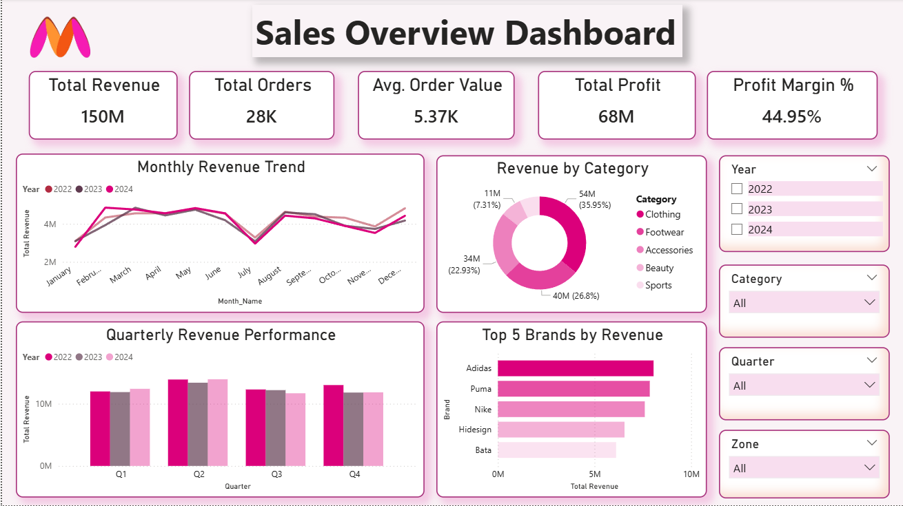
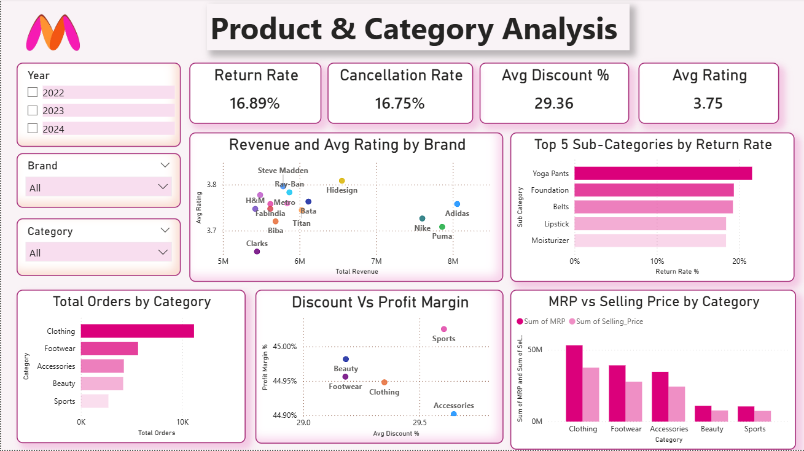
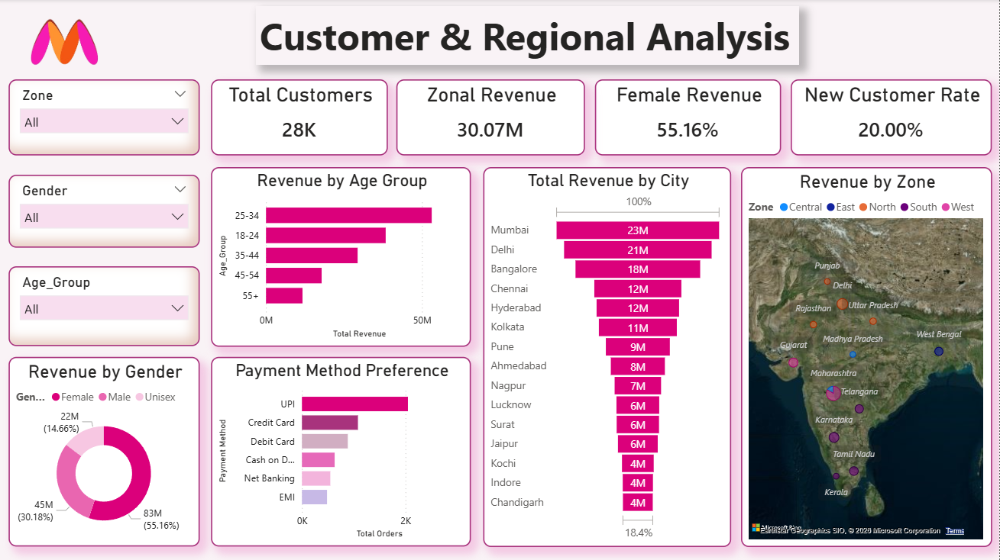
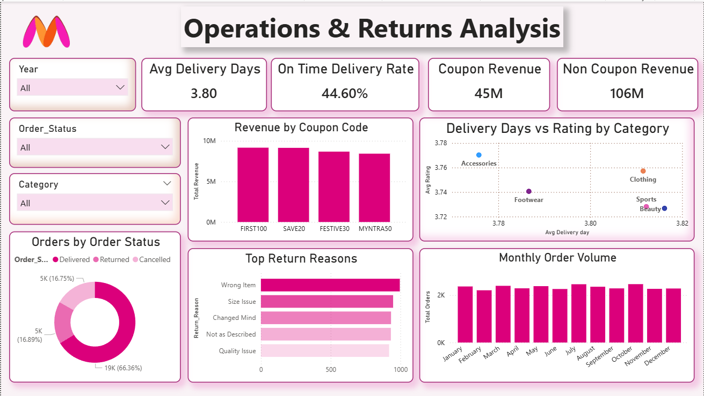

# 🛍️ Myntra Sales Analytics Dashboard — Power BI

An interactive Power BI dashboard analyzing Myntra's e-commerce performance across sales, products, customers, and operations — delivering actionable retail insights through dynamic visualizations and interactive filtering.

---

## Dashboard Preview

| Sales Overview | Product & Category Analysis |
|---|---|
|  |  |

| Customer & Regional Analysis | Operations & Returns |
|---|---|
|  |  |

---

## Key Highlights

- **28K orders analyzed** across 3 years (2022–2024) covering 5 categories and 15+ brands including Adidas, Nike, Puma & H&M
- **₹150M Total Revenue** with a **44.95% Profit Margin** tracked across monthly and quarterly trends
- **City-level & Zone-level mapping** — Revenue visualized across 15+ Indian cities with an interactive India map
- **Return & Cancellation intelligence** — 16.89% Return Rate and 16.75% Cancellation Rate broken down by reason (Wrong Item, Size Issue, Quality Issue)
- **Payment behaviour analysis** — UPI, Credit Card, Debit Card, COD, Net Banking and EMI all tracked
- **Coupon impact measured** — ₹45M Coupon Revenue vs ₹106M Non-Coupon Revenue across 4 codes (FIRST100, SAVE20, FESTIVE30, MYNTRA50)
- **Customer segmentation** — Revenue by Gender, Age Group (18–24 to 55+) and 20% New Customer Rate

---

## Dashboard Pages

| Page | What It Shows |
|---|---|
| Sales Overview | Total Revenue 150M, Orders 28K, Profit 68M, Avg Order Value 5.37K, Monthly & Quarterly trends, Top 5 Brands & Revenue by Category |
| Product & Category Analysis | Return Rate 16.89%, Cancellation Rate 16.75%, Avg Discount 29.36%, Revenue & Rating by Brand, MRP vs Selling Price, Top Sub-Categories by Return Rate |
| Customer & Regional Analysis | Revenue by Gender (Female 55.16%), Age Group, City & Zone map, Payment Method Preference, New Customer Rate 20% |
| Operations & Returns | Avg Delivery Days 3.80, On-Time Delivery 44.60%, Coupon vs Non-Coupon Revenue, Top Return Reasons, Monthly Order Volume |

---

## Dataset

Data sourced from **Kaggle** — containing 28,000 orders across categories, brands, regions, and customer demographics.

---

## Getting Started

1. Install [Power BI Desktop](https://powerbi.microsoft.com/desktop/) (free)
2. Clone this repo and open `MYNTRA.pbix`
3. Use the slicers to filter by Year, Category, Gender, Zone and explore insights

---

## Tech Stack

`Power BI Desktop` &nbsp;|&nbsp; `DAX` &nbsp;|&nbsp; `Power Query (M)` &nbsp;|&nbsp; `Excel`
